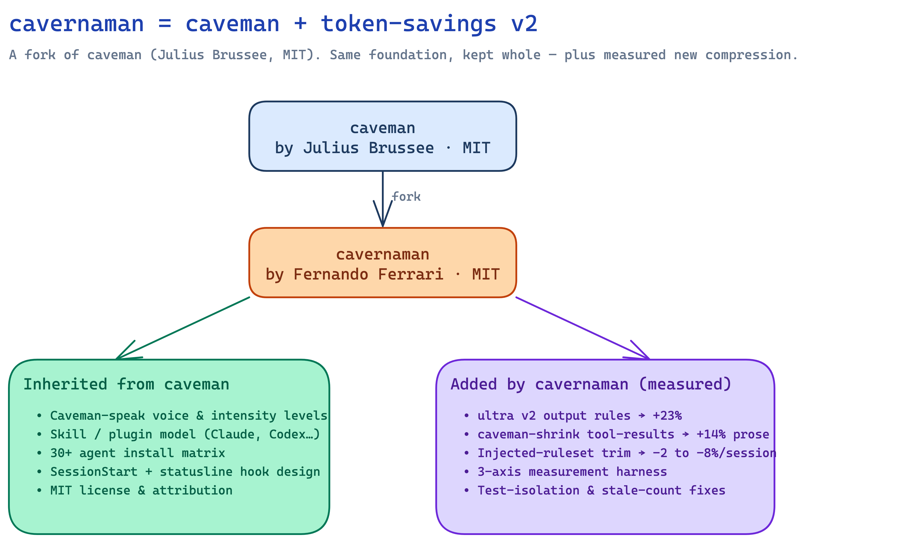
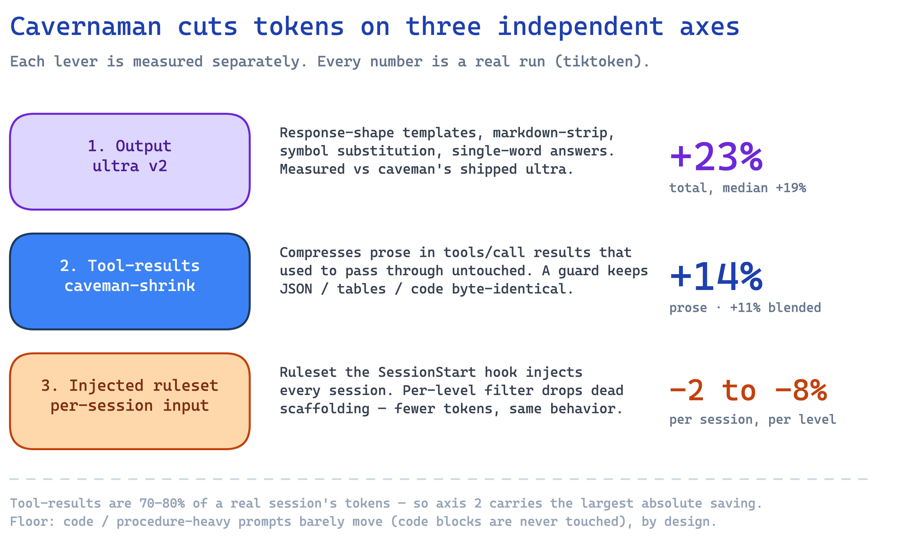
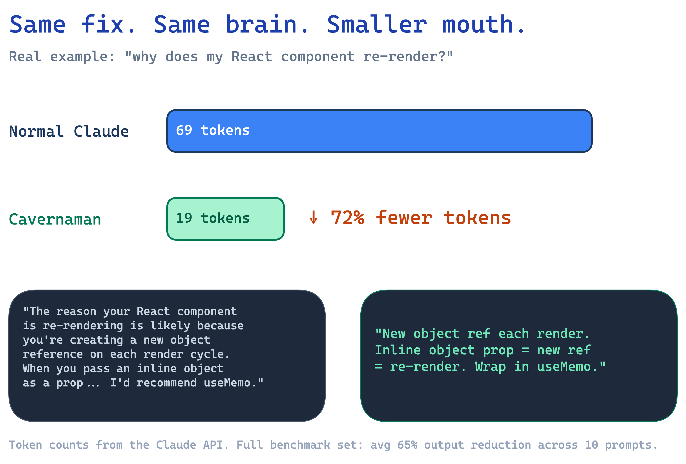
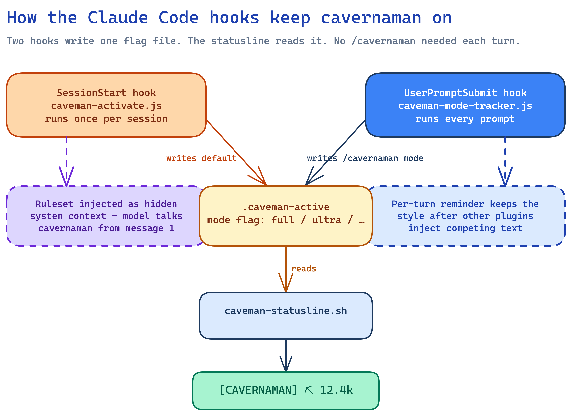

# cavernaman vs. caveman

> Brain still big. Mouth got smaller — **and measured.**

This page explains, in detail, how **cavernaman** differs from the project it
descends from, **[caveman](https://github.com/JuliusBrussee/caveman)** by Julius
Brussee. If you just want to install and go, the [README](../README.md) is enough.
Read on if you want to know exactly what the fork changed and what the numbers are.

---

## First: thank you, caveman 🙏

cavernaman would not exist without **caveman**. caveman invented the whole idea:
make an AI coding agent answer in compressed, caveman-style prose, keep every bit
of technical substance, and ship it as a skill that installs across 30+ agents.
The voice, the intensity levels, the SessionStart-hook trick that makes Claude
Code talk terse from message one, the cross-agent install matrix — that
foundation is caveman's, and cavernaman keeps it whole.

caveman is **MIT licensed** (Copyright © 2026 Julius Brussee). cavernaman is a
derivative work under the same license. The original copyright and license live
verbatim in [`LICENSE`](../LICENSE); the modifications are recorded in
[`NOTICE`](../NOTICE). If you like cavernaman, **go star
[caveman](https://github.com/JuliusBrussee/caveman)** — it's the source.

---

## The one-line difference



cavernaman is **caveman + a "token-savings v2" pass**: the same product, plus a
rewritten `ultra` mode, tool-result compression, a smaller per-session ruleset,
and a measurement harness that proves each of those wins with real runs.

---

## What's the same (inherited from caveman)

cavernaman does **not** re-invent caveman. These come straight from upstream and
are unchanged in spirit:

- **The caveman-speak voice** and the intensity levels (`lite`, `full`, `ultra`,
  plus the `wenyan-*` classical-Chinese variants).
- **The skill / plugin model** — Markdown `SKILL.md` files consumed by Claude
  Code and by `npx skills` for other agents.
- **The 30+ agent install matrix** (Claude Code, Codex, Gemini, Cursor, Windsurf,
  Cline, Copilot, and many more).
- **The hook architecture** — SessionStart injects the ruleset, a flag file tracks
  the active mode, the statusline shows a badge.
- **The auto-clarity rule** — cavernaman drops back to plain prose for security
  warnings, irreversible-action confirmations, and other places where compression
  would create ambiguity.
- **MIT licensing and attribution.**

If you've used caveman, cavernaman feels identical to use. The difference is what
happens to the tokens.

---

## What cavernaman adds (measured)

Every number below is a **real run**, not an estimate. Tokenizer is
`tiktoken o200k_base` (an approximation of Claude's BPE — ratios are meaningful,
absolute counts approximate). Full methodology and reproduction commands live in
[`benchmarks/SAVINGS.md`](../benchmarks/SAVINGS.md). The honest comparison is
always **vs. caveman's previously-shipped behavior**, not vs. a verbose baseline.

### 1. `ultra` v2 — tighter output

cavernaman's `ultra` mode gained: response-shape templates (applied across all
modes), markdown-strip, an expanded abbreviation dictionary, symbol substitution
(`and`→`&`, `→`, `w/`), single-word factual answers, and meta-label dropping.

Measured on the 10 eval prompts (`evals/ultra_delta.py`, real `claude -p` output):

| Comparison | Result |
|---|---|
| ultra-v2 **vs. caveman's shipped ultra** | **+23% total** reduction (2537 → 1960 tokens), median +19% |
| ultra-v2 vs. a terse control | +34% total (2952 → 1960) |

```bash
uv run --with tiktoken python evals/ultra_delta.py
```

### 2. `caveman-shrink` v2 — compressing tool-result prose

`caveman-shrink` is MCP middleware that wraps any MCP server. cavernaman extended
it to compress **prose inside `tools/call` result content** — text that used to
pass through completely untouched. A `looksStructured()` guard sends JSON, tables,
listings, and base64 through **byte-identical**, so only genuine prose is rewritten;
code, URLs, paths, identifiers, and error strings are preserved by the existing
protected-segment logic. It also now compresses the nested
`inputSchema.properties.*.description` fields returned on `*/list` — the bulk of a
large tool schema, re-sent every session.

Measured on a representative mixed corpus (`benchmarks/tool_results/`):

| Subset | Reduction |
|---|---|
| Prose results (what the lever targets) | **+14%** (346 → 296 tokens) |
| Blended, realistic mix of prose + structured | **+11%** (444 → 394 tokens) |

```bash
node benchmarks/tool_results/run.js && uv run --with tiktoken python benchmarks/tool_results/measure.py
```

### 3. Injected-ruleset trim — cheaper every session

The SessionStart hook injects the cavernaman ruleset as system context **every
session** — that's recurring *input* cost. cavernaman's per-level filter now also
trims the scaffolding it used to leave behind (orphaned table headers and example
labels), with no change to behavior.

Measured injected payload per level (`evals/inject_size.py`):

| Level | before | after | delta |
|-------|-------:|------:|------:|
| lite | 748 | 697 | **−7%** |
| full | 780 | 760 | **−3%** |
| ultra | 978 | 958 | **−2%** |
| wenyan-lite | 733 | 674 | **−8%** |
| wenyan-full | 773 | 722 | **−7%** |
| wenyan-ultra | 738 | 687 | **−7%** |

```bash
uv run --with tiktoken python evals/inject_size.py
```

### 4. A three-axis measurement harness

caveman measured output savings. cavernaman measures **three independent axes**
and ships the harness so anyone can reproduce them. This is itself a difference:
the savings claims are checkable, and floor cases are shown rather than hidden.

### 5. Fixes

- Test isolation via `OPENCLAW_WORKSPACE` (tests no longer touch a real workspace).
- A stale-count fix in the stats path.

---

## The three-axis savings model

A single cavernaman reply is a small slice of a real session. Tool-call results
and pasted context are ~70–80% of the token budget; the model's own prose is only
~15–25%. So cavernaman attacks the bill on three **independent** levers and
measures each one separately:



Because tool-results are the largest token pool, axis 2 carries the biggest
absolute saving on a realistic session — even though its percentage looks smaller
than axis 1.

---

## Same fix, smaller mouth

The point of all of this is unchanged from caveman: **identical technical content,
far fewer tokens.**



Across the 10-prompt benchmark set, cavernaman averages a **65% output reduction**
(range 22–87%). Raw data: [`benchmarks/`](../benchmarks/).

---

## How it stays on (Claude Code)

The hook plumbing cavernaman inherits from caveman, for reference:



Two hooks write one flag file (`.caveman-active`); the statusline reads it. The
SessionStart hook also injects the ruleset as hidden system context, so the model
talks cavernaman from message one — no `/cavernaman` needed each turn.

---

## Honest caveats

cavernaman keeps caveman's honesty about where compression *doesn't* help:

- **Code and procedures barely move.** Code blocks are never touched, by design.
  Code/procedure-heavy prompts hold the output median down to +19% — those cases
  are shown in the eval tables, not hidden.
- **Structured data is protected.** A session dominated by JSON, tables, listings,
  URLs, paths, or error strings sees less savings; a prose-heavy session sees more.
- **Thinking tokens are untouched.** cavernaman shrinks the *mouth*, not the brain.
  Reasoning/thinking tokens are unaffected — the biggest practical win is
  readability and speed, with cost savings as a bonus.
- **Tokenizer is an approximation.** `tiktoken` ≠ Claude's exact BPE, so absolute
  numbers are approximate; the **ratios** are what matter.

---

## See also

- [README](../README.md) — product overview and install
- [`NOTICE`](../NOTICE) — derivative-work attribution
- [`benchmarks/SAVINGS.md`](../benchmarks/SAVINGS.md) — full three-axis methodology
- [caveman](https://github.com/JuliusBrussee/caveman) — the upstream project. Go star it.
